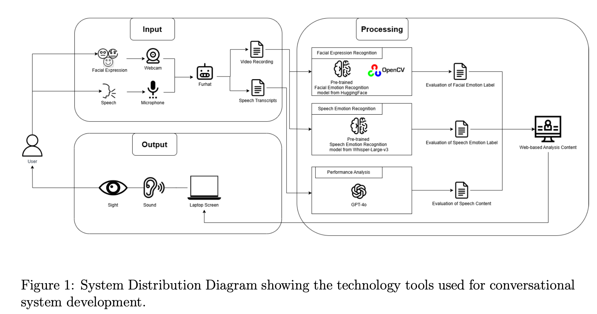
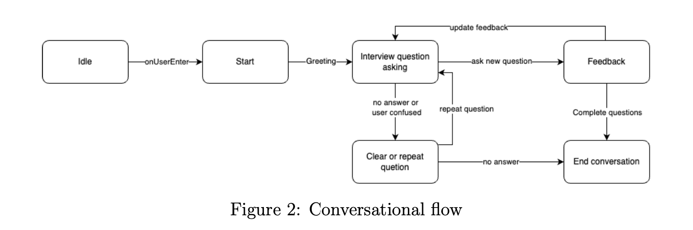
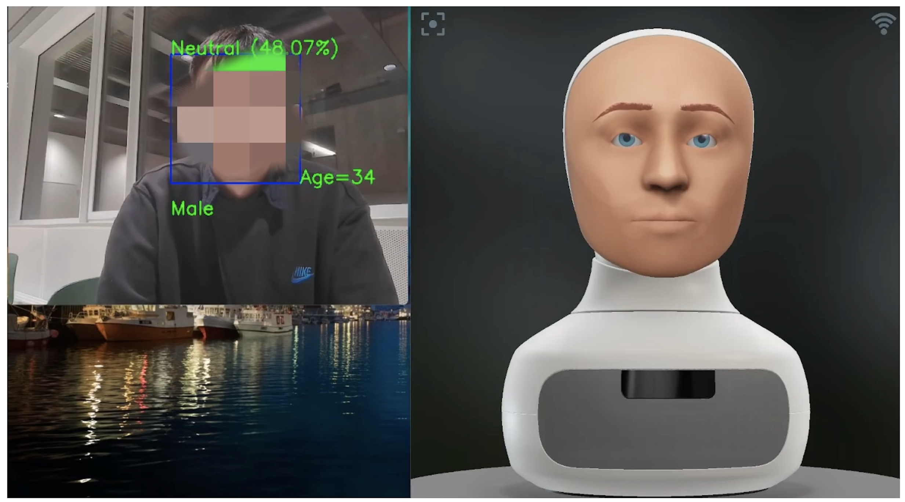
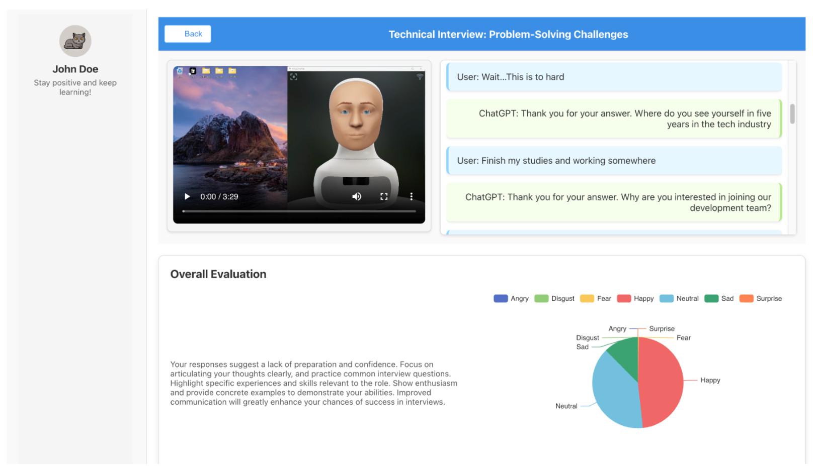

# Multimodal Career Coach Robot

This project demonstrates a three-part system that provides a simulated interview experience using a **Furhat robot** as the primary interface. The system combines:

1. A **robot-based conversational system** that asks interview questions and provides real-time feedback.
2. **Emotion Recognition Modules** (Facial Emotion Recognition and Speech Emotion Recognition) to process visual and auditory cues in real time.
3. A **web-based platform** that displays the interview results, including video recordings, transcripts, GPT-based feedback, and visualizations of detected emotional states.

---

## Table of Contents

- [Features](#features)
- [Architecture and Workflow](#architecture-and-workflow)
- [Technologies Used](#technologies-used)

---

## Features

- **Conversational Flow**: Utilizes the Furhat SDK to manage conversation states such as greeting, questioning, clarifying, providing feedback, and ending the session.
- **Facial Emotion Recognition (FER)**: Analyzes live video to detect and classify expressions such as Angry, Disgust, Fear, Happy, Neutral, Sad, and Surprise, and optionally estimates age and gender.
- **Speech Emotion Recognition (SER)**: Processes audio to classify emotions (Anger, Disgust, Fear, Happiness, Neutral, Sadness, Surprise).
- **GPT-4o Integration**: Evaluates user responses and generates feedback on interview performance, including suggestions for improvement.
- **Web-based Dashboard**: Displays transcripts, video recordings, summarized emotional states, and GPT-generated feedback.

---

## Architecture and Workflow

1. **Input**

   - **Webcam**: Captures facial expressions for real-time emotion recognition.
   - **Microphone**: Captures audio, which is then transcribed and analyzed for emotional cues.
   - **Furhat Robot**: Serves as the primary interface for user interaction, prompting questions, and delivering feedback.

2. **Processing**

   - **Facial Emotion Recognition (FER)**: A pre-trained model (from Hugging Face / OpenCV) runs in real time, returning the dominant emotion, an emotion distribution, and optional age/gender estimates.
   - **Speech Emotion Recognition (SER)**: A pre-trained model (e.g., Whisper-Large-v3) for vocal emotion analysis and speech transcription.
   - **GPT-4o**: Uses the text transcripts to generate performance analysis and feedback.

3. **Output**
   - **Web-based Platform**: Displays the generated transcripts, videos, emotion labels, and GPT-4o feedback.
   - **Text Files**: FER and SER modules save output (emotion labels, distributions, optional metadata) for post-processing and visualization.

---

## Human-Robot Interaction

---

## Website layout

---

## Technologies Used

- **Furhat SDK** (Java/Kotlin)
- **IntelliJ IDEA Community Edition**
- **OpenCV** (for real-time facial emotion detection)
- **HuggingFace** (pre-trained emotion recognition models)
- **Whisper-Large-v3** (speech emotion recognition & transcription)
- **GPT-4o** (performance analysis and feedback)
- **HTML/CSS/JavaScript** (web-based analysis platform)

---
